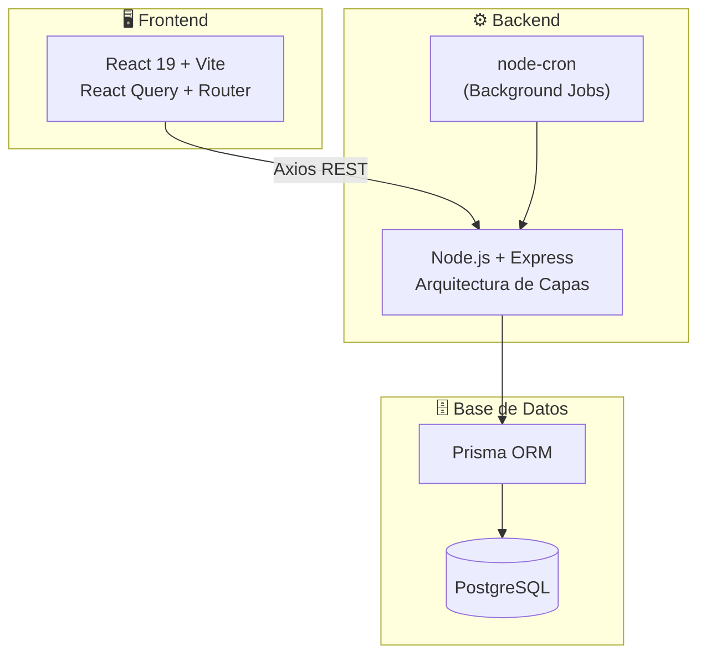
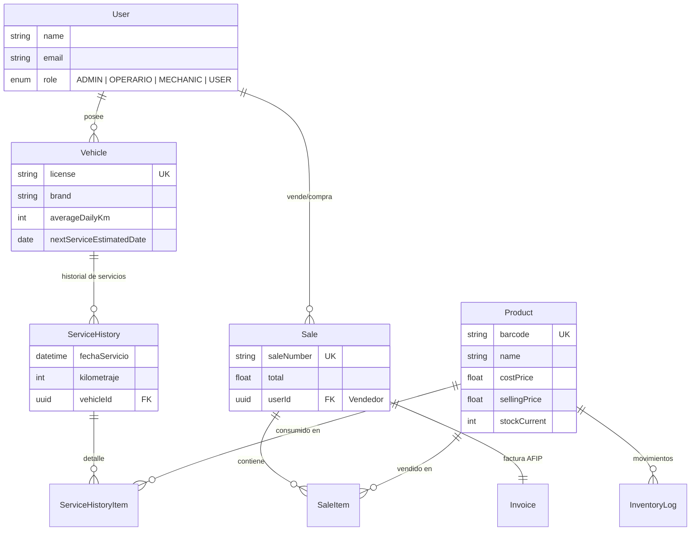

# 🛢️ Sistema de Gestión — Lubricentro Asensio

**Plataforma integral para la operación diaria de un lubricentro**

Control de inventario · Punto de venta · Facturación electrónica AFIP · Servicios vehiculares · Marketing predictivo

---

---

## 📋 Tabla de Contenidos

- [Sobre mi proyecto](#-sobre-mi-proyecto)
- [Funcionalidades Principales](#-funcionalidades-principales)
- [Arquitectura del Sistema](#-arquitectura-del-sistema)
- [Diagrama de Base de Datos](#-diagrama-de-base-de-datos)
- [Stack Tecnológico](#-stack-tecnológico)
- [Capturas de Pantalla](#-capturas-de-pantalla)

---

## 💡 Sobre mi proyecto

Sistema diseñado para digitalizar y optimizar la operación diaria de un lubricentro, cubriendo todo el flujo comercial y técnico del negocio: desde la carga de productos e inventario, pasando por el punto de venta con generación de remitos, hasta el historial técnico de cada vehículo con recordatorios automáticos de mantenimiento.

El sistema resuelve problemas reales del rubro:

- **Visibilidad del costo**: Los operarios ven un costo inverso calculado a partir del margen, protegiendo los márgenes reales del negocio.
- **Trazabilidad completa**: Cada movimiento de stock, venta o servicio queda registrado.
- **Marketing predictivo**: El sistema calcula automáticamente cuándo un vehículo necesita su próximo service basándose en el promedio de km diarios recorridos.
- **Facturación legal**: Integración directa con ARCA/AFIP para emitir Facturas C electrónicas con CAE.

---

## ✨ Funcionalidades Principales

- **📦 Inventario Inteligente**: CRUD de productos, control de stock con alertas, código de barras, actualización masiva y costo inverso para operarios.
- **🧾 Punto de Venta (POS)**: Generación de remitos, descuentos, vinculación de clientes y facturación electrónica AFIP directa.
- **🔧 Servicios y Taller**: Historial por vehículo, consumo de productos de inventario, patrón "Snapshot" para congelar precios.
- **🚗 CRM y Marketing**: Cálculo de km promedio diario, estimación de próximo service y recordatorios automatizados por WhatsApp/Email.
- **📅 Reservas Online**: Sistema de turnos vinculados a servicios y vehículos.
- **📈 Analíticas**: Dashboard de ventas y gráficos interactivos del rendimiento del negocio.

---

## 🏗️ Arquitectura del Sistema

---

## 🗃️ Diagrama de Base de Datos

Diagrama simplificado con las entidades core del sistema (excluyendo catálogos y entidades secundarias):

---

## 🛠️ Stack Tecnológico

**Frontend**: React 19, Vite, React Router v7, React Query (TanStack), React Bootstrap, Recharts.  
**Backend**: Node.js, Express.js, TypeScript, Prisma ORM, Zod, JWT (Autenticación persistida en localStorage).  
**Base de Datos**: PostgreSQL.  
**Integraciones**: AFIP SDK (Factura Electrónica), Resend (Emails).  
**DevOps**: Docker & Docker Compose (Multi-stage builds), Nginx.

---

## 📸 Capturas del Sistema

### 1. Punto de Venta (POS) y Facturación

<!--  -->

_Panel principal de ventas, carrito de compras y generación de remitos/facturas._

### 2. Gestión de Inventario

<!--  -->

_Control de productos, stock, precios y herramientas de actualización masiva._

### 3. Ficha Técnica y Servicios

<!--  -->

_Historial de mantenimiento del vehículo, observaciones del mecánico y productos consumidos._

### 4. Dashboard de Analíticas

<!--  -->

_Métricas del negocio, evolución de ventas y estadísticas de desempeño._
