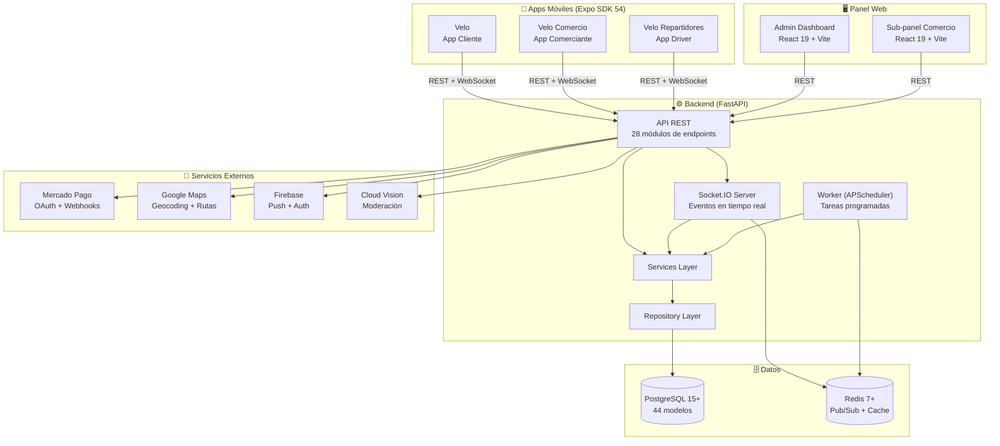
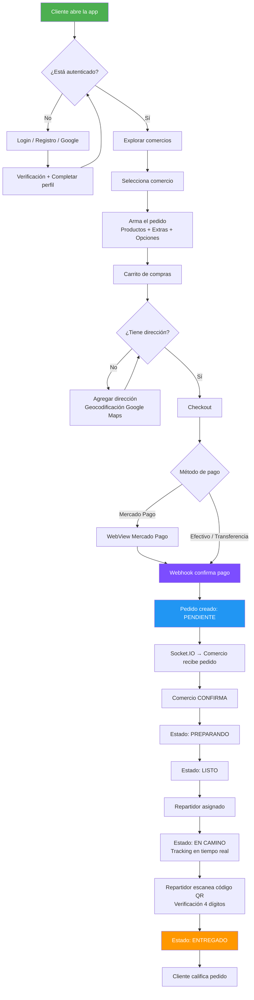
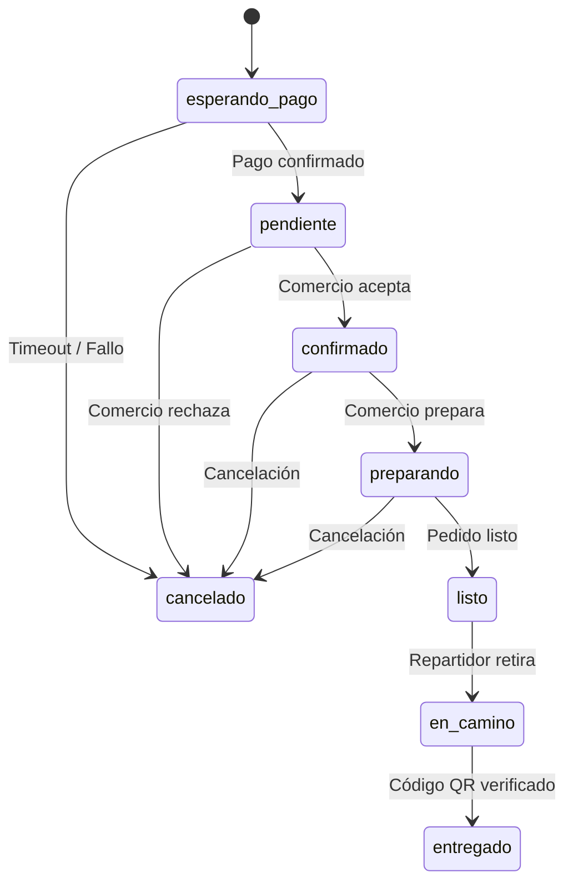
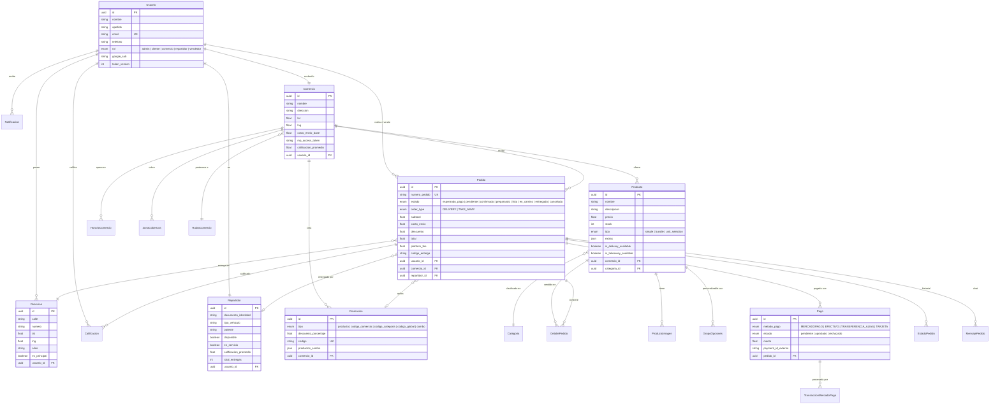
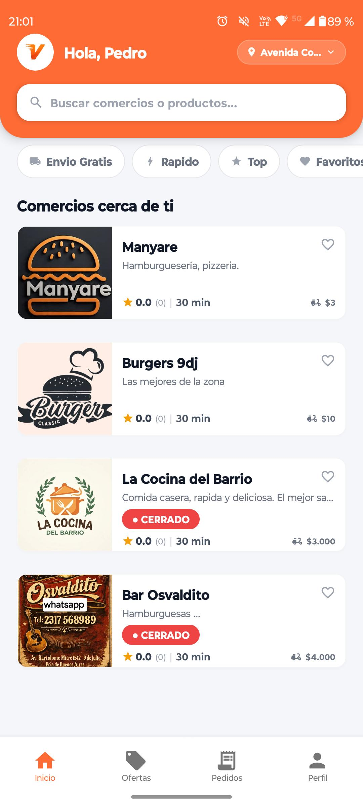
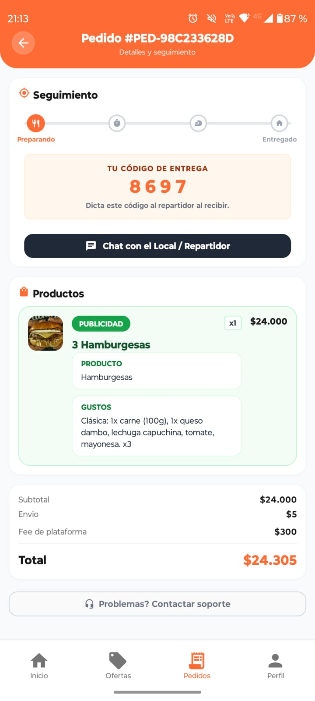
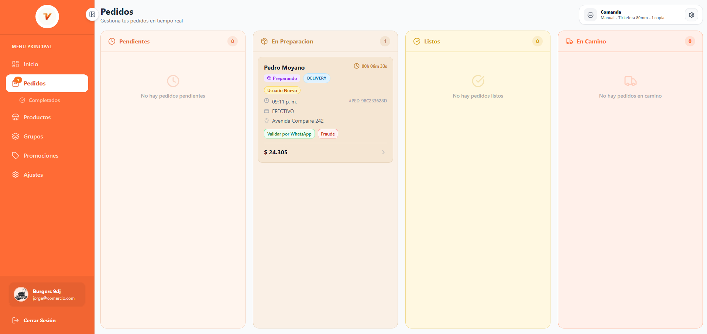
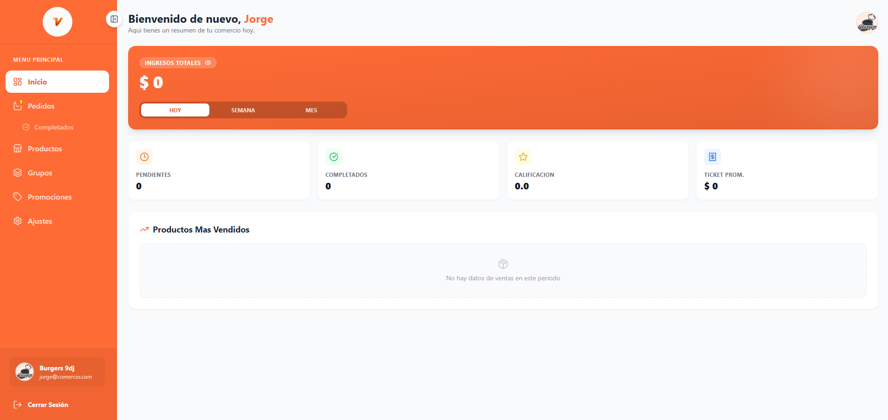
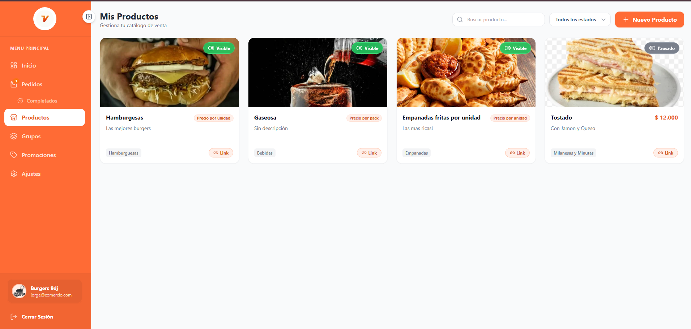
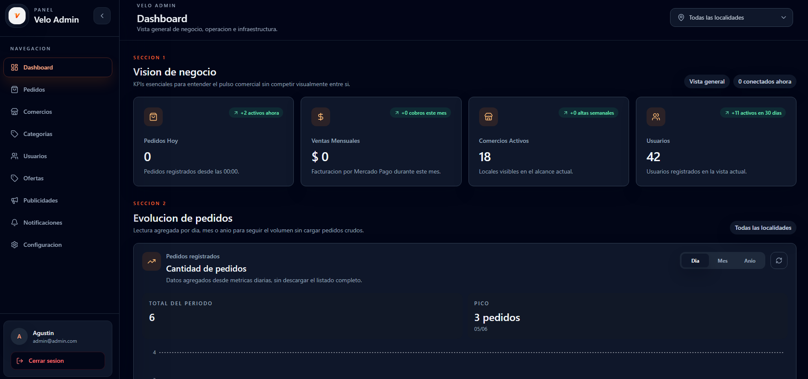

# 🛵 Velo — Plataforma de Delivery

**Marketplace de delivery de comida que conecta comercios, clientes y repartidores**

Pedidos en tiempo real · Pagos con Mercado Pago · Tracking GPS · 3 apps móviles · Panel de administración

---

 

---

## 📋 Tabla de Contenidos

- [Sobre el proyecto](#-sobre-el-proyecto)
- [Funcionalidades Principales](#-funcionalidades-principales)
- [Arquitectura del Sistema](#-arquitectura-del-sistema)
- [Diagrama de Flujo](#-diagrama-de-flujo)
- [Diagrama de Base de Datos](#-diagrama-de-base-de-datos)
- [Stack Tecnológico](#-stack-tecnológico)
- [Capturas de Pantalla](#-capturas-de-pantalla)

---

## 💡 Sobre el proyecto

Velo es una plataforma completa de delivery de comida diseñada para el mercado argentino. Conecta tres actores clave: **clientes** que realizan pedidos, **comercios** que venden sus productos y **repartidores** que realizan las entregas. La plataforma está publicada en **App Store** y **Google Play Store**, y opera en producción bajo el dominio **veloapp.com.ar**.

El sistema se compone de un monorepo con **3 aplicaciones móviles independientes**, un **panel web de administración** con sub-panel para comercios, y un **backend con comunicación en tiempo real vía Socket.IO**.

Problemas que resuelve:

- **Operación en tiempo real**: Socket.IO con Redis permite tracking de pedidos, notificaciones instantáneas y coordinación entre los tres actores.
- **Pagos integrados**: Mercado Pago con OAuth por comercio, split de pagos automático (subtotal al comercio, comisión a la plataforma) y soporte de efectivo/transferencia.
- **Logística inteligente**: Cálculo de costos de envío con Google Maps Distance Matrix, zonas de cobertura configurables y estimación de tiempos.
- **Escalabilidad**: Worker dedicado con APScheduler y leader election vía Redis para entornos multi-nodo.

---

## ✨ Funcionalidades Principales

**App Velo — Cliente (iOS & Android)**

- Exploración de comercios por localidad, carrito con extras/combos y checkout (Mercado Pago, efectivo, transferencia).
- Tracking de pedido en tiempo real vía Socket.IO con calificaciones y notificaciones push.
- Gestión de direcciones con geocodificación y sistema de promociones/cupones.

**App Velo Comercio — Comerciante (iOS & Android)**

- Recepción y gestión de pedidos en tiempo real con chat integrado y dashboard de métricas.
- CRUD de productos con opciones, extras, imágenes, horarios de atención y zonas de cobertura.
- Vinculación con Mercado Pago vía OAuth y gestión de promociones.

**App Velo Repartidores — Driver (iOS & Android)**

- Dashboard de pedidos asignados con escáner QR para verificación de entrega.
- Chat con el cliente e historial de entregas con calificaciones.

**Panel Web de Administración**

- Dashboard de analíticas, gestión de comercios/usuarios/repartidores y control de pedidos.
- Campañas de promociones, notificaciones push masivas y configuración de comisiones.
- Sub-panel para comercios con gestión autónoma de productos, pedidos y configuración.

---

## 🏗️ Arquitectura del Sistema

---

## 🔄 Diagrama de Flujo

Flujo principal de un pedido desde la perspectiva del cliente:

**Máquina de estados del pedido:**

---

## 🗃️ Diagrama de Base de Datos

Modelo entidad-relación simplificado con las entidades core del sistema (44 modelos en total, se muestran las principales):

---

## 🛠️ Stack Tecnológico

**App Móvil (x3)**: React Native 0.81, Expo SDK 54, TypeScript, NativeWind, React Navigation 7.  
**Panel Web**: React 19, Vite 7, TypeScript, TailwindCSS, Recharts, Leaflet.  
**Backend**: Python 3.11, FastAPI, SQLAlchemy 2.0, Pydantic v2, Socket.IO, Redis.  
**Base de Datos**: PostgreSQL 15+.  
**Integraciones**: Mercado Pago (OAuth + split payments), Google Maps API, Firebase (FCM + Auth), Google Cloud Vision.  
**Infraestructura**: VPS Ubuntu, Gunicorn + Nginx, systemd.

---

## 📸 Capturas de Pantalla

### 1. Exploración de Comercios

_Pantalla principal de exploración de comercios disponibles por localidad._

### 2. Detalle de Pedido y Tracking

_Seguimiento en tiempo real del pedido con estados y chat integrado._

### 3. Panel de Comercio

_Dashboard del comerciante con pedidos entrantes, métricas y gestión de productos._

### 4. Panel de Administración

_Dashboard administrativo con analíticas de pedidos, ingresos y usuarios activos._
